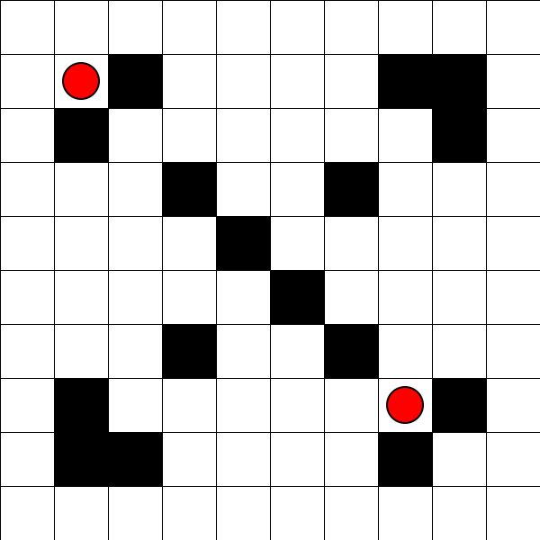
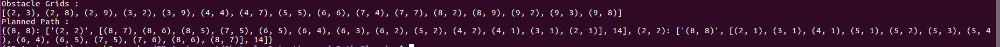

# Image Processing Project - Path Planning for a Robot
Path planning is a technique used to find the shortest path between a source and destination in least time and in most optimized way.

### Given:

A set of test images, each containing

1. 10x10 grid 
2. Obstacles are marked as black filled squares
3. Source and Destination are marked by red circles 

The squares are identified by the coordinate (x,y) where x is the column and y is the row to which the square belongs. Each square
can be empty, have an obstacle or marked as source/destination.

### The program returns 2 results:

1. <b><u>Coordinates of occupied grid (obstacles)</u></b>:

	Python list having ‘n’ python tuples, where ‘n’ denotes number of occupied grids (obstacles) in the test image. Each tuple has two elements. The elements are x-coordinate and y-coordinate of an obstacle.

2. <b><u/>Minimum path<u/></b>:

	The two red circles indicate the source and destination. Either of the red circles can be the source or destination. Traversal is done by moving either horizontally or vertically using the A* search algorithm. The length of the path is determined by the number of moves made during traversal. 

The code returns a python dictionary of the following format
* Key for dictionary is a tuple - (x,y) coordinate of the source
* first element of dictionary is a tuple - (x,y) coordinate of the destination
* second element is a list of tuples having (x,y) coordinate of all grids traversed along the route path
* third element of dictionary represents the number of moves taken for traversal

## Basic Usage

Run `main.py` to check the results.

The `process_image.py` contains the major code.

`astarsearch.py` contains the implementation of A* search algo. 

`traversal.py` contains the script to traverse through the image to find objects/min path. 

## Dependencies

1.  Install OpenCV for Python
2. Install skimage (or scikit-image)
3. Install numpy 

